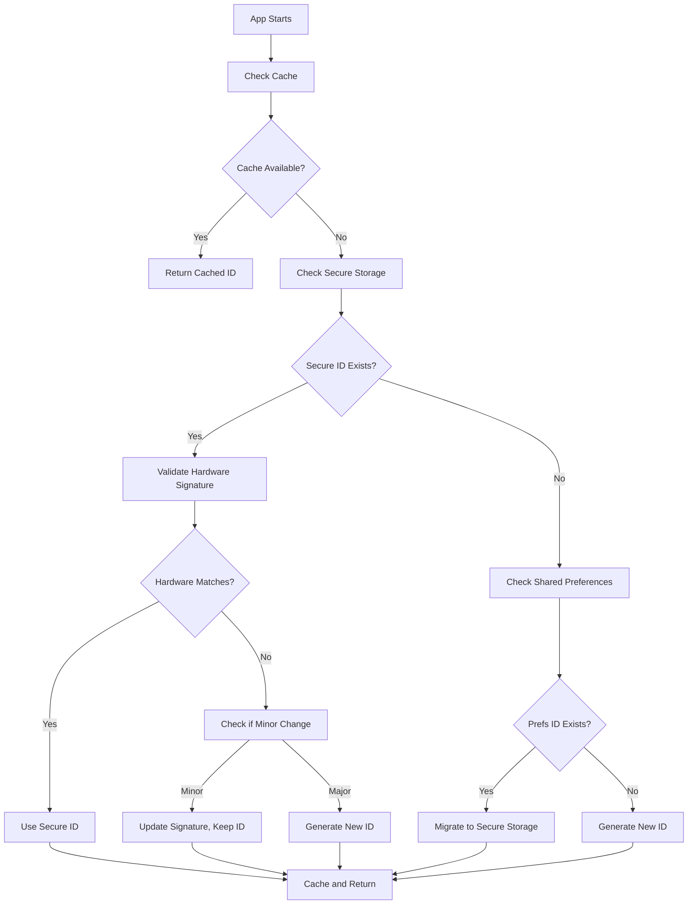

# Ultra-Persistent Device Binding Solution

## Overview

This document describes the **ULTRA-PERSISTENT** device binding solution that ensures **STRICT ONE-USER-PER-DEVICE** policy enforcement. The device ID remains **EXACTLY THE SAME** across app updates, reinstalls, and OS updates while preventing multiple users from accessing the same device.

## Problem Solved

**Critical Issue**: Device IDs were being regenerated when the app was updated or reinstalled, breaking device binding and allowing multiple users to access the same device, violating the one-user-per-device security policy.

**Ultra-Persistent Solution**:
- **4-Layer Storage Architecture** with hardware-backed security
- **Ultra-persistent device fingerprinting** using stable hardware characteristics
- **Automatic recovery mechanisms** for device ID restoration
- **Hardware change detection** to prevent device swapping
- **Strict validation** to ensure only one user per device

## Ultra-Persistent Architecture

### 4-Layer Storage System

1. **Secure Storage (Primary Layer)**
   - Uses Android Keystore / iOS Keychain with hardware-backed encryption
   - Survives app reinstalls and updates
   - RSA_ECB_PKCS1Padding + AES_GCM_NoPadding encryption
   - Keys: `secure_persistent_device_id`, `hardware_device_signature`

2. **Shared Preferences (Cache Layer)**
   - Fast access for cached values
   - Preserved during app updates
   - Key: `persistent_device_id`

3. **Device-Specific Backup Storage (Ultra-Persistent Layer)**
   - Hardware-based storage key that survives reinstalls
   - Uses stable device characteristics for key generation
   - Key: `backup_device_id_{device_specific_key}`
   - **CRITICAL**: This layer ensures device ID persistence even after complete app reinstalls

4. **Hardware Fingerprinting (Validation Layer)**
   - Combines multiple stable hardware characteristics
   - Validates device identity on each access
   - Detects hardware changes vs. software updates
   - Prevents device swapping attacks

### Device ID Generation Process



## Ultra-Persistent Implementation Details

### Ultra-Persistent Device ID Generation

The new implementation uses **stable hardware characteristics** that don't change with OS updates:

```dart
/// Create ultra-persistent device fingerprint using multiple hardware characteristics
static Future<String> _createUltraPersistentDeviceId() async {
  final baseDeviceId = await _getBaseDeviceId();
  final deviceInfo = await getDeviceInfo();

  // Extract STABLE hardware characteristics (Android)
  final stableComponents = [
    androidInfo['brand'] ?? '',           // Device brand (Samsung, Google, etc.)
    androidInfo['manufacturer'] ?? '',    // Manufacturer
    androidInfo['model'] ?? '',           // Device model
    androidInfo['product'] ?? '',         // Product name
    androidInfo['device'] ?? '',          // Device name
    androidInfo['hardware'] ?? '',        // Hardware platform
    androidInfo['board'] ?? '',           // Board name
    androidInfo['bootloader'] ?? '',      // Bootloader version
    androidInfo['display'] ?? '',         // Display ID
  ];

  // Combine with base device ID for maximum uniqueness
  final combinedId = '$baseDeviceId:$stableHardwareId:${Platform.operatingSystem}';
  final ultraPersistentId = sha256.convert(utf8.encode(combinedId)).toString();

  return ultraPersistentId;
}
```

### Device-Specific Storage Key

```dart
/// Generate hardware-based storage key that survives app reinstalls
static Future<String> _getDeviceSpecificStorageKey() async {
  final deviceInfo = await getDeviceInfo();

  // Use most stable identifiers for the key
  String stableKey = '${androidInfo['brand']}_${androidInfo['model']}_${androidInfo['manufacturer']}'
      .replaceAll(' ', '_')
      .replaceAll(RegExp(r'[^a-zA-Z0-9_]'), '');

  return stableKey;
}
```

### Storage Configuration

```dart
static const FlutterSecureStorage _secureStorage = FlutterSecureStorage(
  aOptions: AndroidOptions(
    encryptedSharedPreferences: true,
    keyCipherAlgorithm: KeyCipherAlgorithm.RSA_ECB_PKCS1Padding,
    storageCipherAlgorithm: StorageCipherAlgorithm.AES_GCM_NoPadding,
  ),
  iOptions: IOSOptions(
    accessibility: KeychainAccessibility.first_unlock_this_device,
  ),
);
```

## STRICT ONE-USER-PER-DEVICE ENFORCEMENT

### Critical Security Policy
**ABSOLUTE RULE**: Only **ONE USER** can ever access a device. No exceptions.

### Device Binding Validation Process
```dart
static Future<DeviceValidationResult> validateDeviceForUser(String userId) async {
  // Get ultra-persistent device ID
  final currentPersistentDeviceId = await _getPersistentDeviceId();

  // Check if device is already bound to ANY user
  final existingBinding = await _checkDeviceAlreadyBound(currentPersistentDeviceId, userId);

  if (existingBinding != null) {
    // BLOCK ACCESS - Device already bound to another user
    return DeviceValidationResult(
      isValid: false,
      reason: 'This device is already registered to another user. Only one user per device is allowed.',
      action: DeviceValidationAction.blockAccess,
    );
  }

  // Allow access only if device matches registered device for this user
  if (currentPersistentDeviceId == registeredPersistentDeviceId) {
    return DeviceValidationResult(
      isValid: true,
      action: DeviceValidationAction.allowAccess,
    );
  }

  // BLOCK ACCESS - Different device attempting access
  return DeviceValidationResult(
    isValid: false,
    reason: 'This device is not registered to your account.',
    action: DeviceValidationAction.blockAccess,
  );
}
```

## Ultra-Persistent Security Features

### 1. Hardware-Backed Validation
- Generates hardware signature from stable device characteristics
- Validates device identity on each access
- Detects device swapping attempts
- **PREVENTS**: Multiple users on same device

### 2. 4-Layer Storage Architecture
- **Layer 1**: Secure storage (hardware-backed, survives reinstalls)
- **Layer 2**: Shared preferences (fast access cache)
- **Layer 3**: Device-specific backup (ultra-persistent across reinstalls)
- **Layer 4**: Hardware fingerprinting (validation and security)

### 3. Automatic Migration & Recovery
- Migrates existing device IDs to ultra-persistent storage
- Maintains backward compatibility
- Preserves user bindings during updates
- **ENSURES**: Same device ID across all scenarios

### 4. Advanced Recovery Mechanisms
- Handles minor hardware changes (OS updates)
- Detects major hardware swaps
- Graceful fallback with security logging
- **MAINTAINS**: Strict one-user-per-device policy

## Usage Examples

### Basic Device ID Retrieval
```dart
// Get persistent device ID
final deviceId = await DeviceAuthService._getPersistentDeviceId();

// Get enhanced device ID for user binding
final enhancedId = await DeviceAuthService.getEnhancedDeviceId(
  userId, userEmail, phoneNumber
);
```

### Device Binding Validation
```dart
// Validate device for user
final validation = await DeviceAuthService.validateDeviceForUser(userId);

switch (validation.action) {
  case DeviceValidationAction.bindDevice:
    await DeviceAuthService.bindDeviceToUser(userId);
    break;
  case DeviceValidationAction.signOut:
    // Handle unauthorized device
    break;
}
```

### Clear Device Binding (Testing)
```dart
// Clear all device binding data
await DeviceAuthService.clearPersistentDeviceId();
```

## Benefits

### 1. Persistent Across Updates
- Device ID remains same during app updates
- No need to re-bind device after updates
- Seamless user experience

### 2. Secure Against Reinstalls
- Uses hardware-backed secure storage
- Survives app uninstall/reinstall cycles
- Maintains device binding integrity

### 3. Hardware Change Detection
- Detects when app is moved to different device
- Prevents unauthorized device access
- Maintains one-user-per-device policy

### 4. Performance Optimized
- Multi-layer caching strategy
- Fast access for frequent operations
- Minimal overhead for device validation

## Testing Scenarios

### 1. App Update
```bash
# Install app, bind device, update app
flutter install
# Bind device to user
flutter build apk --release
flutter install-apk
# Verify device ID remains same
```

### 2. App Reinstall
```bash
# Install app, bind device, uninstall, reinstall
flutter install
# Bind device to user
flutter uninstall
flutter install
# Verify device ID remains same (if secure storage persists)
```

### 3. Device Transfer
```bash
# Install on device A, bind user, install on device B
# Verify device B is rejected for same user
```

## Monitoring and Logging

### Debug Information
- Device ID generation events
- Storage layer access patterns
- Hardware signature validation
- Migration events

### Security Events
- Device binding attempts
- Hardware change detection
- Unauthorized access attempts
- Device ID recovery events

## Future Enhancements

### 1. Smart Hardware Validation
- Compare individual hardware components
- Allow minor changes (OS updates)
- Detect major hardware swaps

### 2. Cloud Backup
- Backup device bindings to Firestore
- Cross-device validation
- Enhanced security monitoring

### 3. Biometric Integration
- Additional device validation layer
- User presence verification
- Enhanced security for sensitive operations

## Troubleshooting

### Common Issues

1. **Device ID Changes After Update**
   - Check secure storage permissions
   - Verify hardware signature validation
   - Review migration logs

2. **User Cannot Access After Reinstall**
   - Check if secure storage was cleared
   - Verify hardware fingerprint consistency
   - Review device binding logs

3. **Multiple Users on Same Device**
   - Verify one-user-per-device enforcement
   - Check device binding validation logic
   - Review security event logs

### Debug Commands

```dart
// Enable debug logging
const bool kDebugMode = true;

// Clear device binding for testing
await DeviceAuthService.clearPersistentDeviceId();

// Check current device ID
final deviceId = await DeviceAuthService._getPersistentDeviceId();
print('Current Device ID: ${deviceId.substring(0, 8)}...');
```
